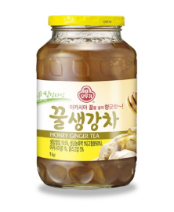
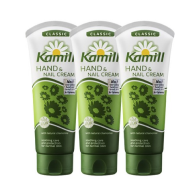
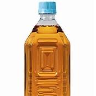

###### mission-01

###### html
```html
<!DOCTYPE html>
<html lang="ko">
<head>
  <meta charset="UTF-8">
  <meta name="viewport" content="width=device-width, initial-scale=1.0">
  <title>mission-01</title>
  <link rel="preconnect" href="https://fonts.googleapis.com" />
  <link rel="preconnect" href="https://fonts.gstatic.com" crossorigin />
  <link
    href="https://fonts.googleapis.com/css2?family=Noto+Sans+KR:wght@300;400;700&family=Noto+Serif+KR:wght@200;300;400;500;600;700;900&display=swap"
    rel="stylesheet"
  />
  <link rel="stylesheet" href="./mission-01.css">
</head>
<body>
  <ul class="product reset-list">
    <li class="size-1">
      <div class="text">
        
        <p class="name">따뜻한 차 향기</p>
      </div>
      <div class="img"></div>
      <a href="/" class="button">
        <div class="button-img"><span>구매하기</span></div>
      </a>
    </li>
    <li class="size-2">
      <div class="text">
        
        <p class="name">핸드크림 모음</p>
      </div>
      <div class="img"></div>
      <a href="/" class="button">
        <div class="button-img"><span>구매하기</span></div>
      </a>
    </li>
    <li class="size-2">
      <div class="text">
        
        <p class="name">고소한 보리차</p>
      </div>
      <div class="img"></div>
      <a href="/" class="button">
        <div class="button-img"><span>구매하기</span></div>
      </a>
    </li>
  </ul>
</body>
</html>
```
